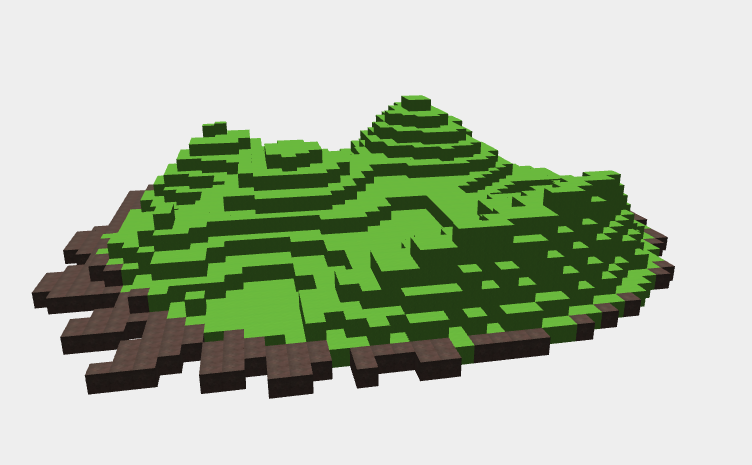
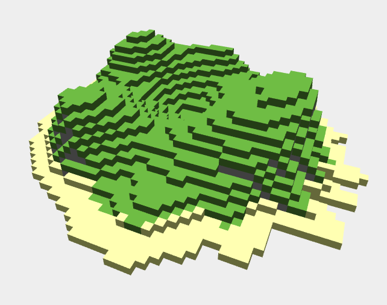
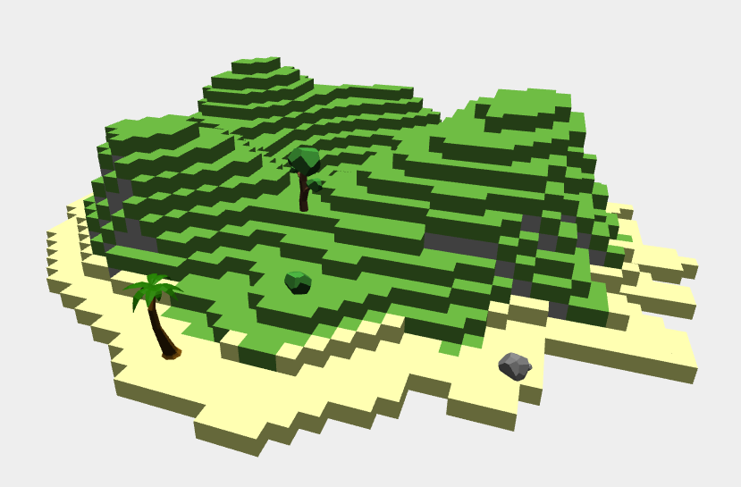

# Lost Island

## Concept

Le joueur s'échoue sur une île perdu. L'île est généré aléatoirement : sa forme vue du ciel et son relief dépend d'une *seed* accessible par le joueur. Le joueur doit récolter des ressources et fabriquer des outils afin de réparer son navire.

## Tester

**Installer les dépendances :**
```
npm install
```

**Lancer le serveur :**
```
npm start
```

**Ouvrir son navigateur** et entrer l'url :
```
http://localhost:8080
```

## Documentation

Pour plus d'information, vous pouvez consulter la documentation [ici](https://maddening-paw-151.notion.site/Lost-Island-5527c3d1ffc5482d9ac08dd516a2e6b4) !

## Quelques images

### La génération aléatoire




### Le texturing et modélisme




