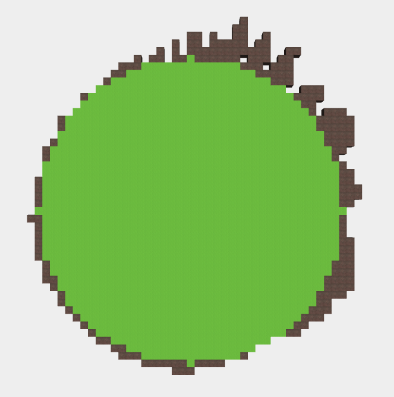

# Lost Island

## Concept

Le joueur s'échoue sur une île perdu. L'île est généré aléatoirement : sa forme vue du ciel et son relief dépend d'une *seed* accessible par le joueur. Le joueur doit récolter des ressources et fabriquer des outils afin de réparer son navire.

## Tester

**Installer les dépendances :**
```
npm install
```

**Lancer le serveur :**
```
npm start
```

**Ouvrir son navigateur** et entrer l'url :
```
http://localhost:8080
```

## Génération aléatoire



